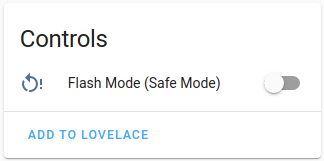

# ESPHome-AirGradient

ESPHome config for AirGradient Air Quality Sensor

[](https://ko-fi.com/ajfriesen)


The AirGradient DIY Air Quality Sensor can be found here: https://www.airgradient.com/diy/

This repository will provide you the ESPHome config to run this with Home Assistant.

# 0. Prerequisites

- You need to have [Home Assistant](https://www.home-assistant.io/installation/) running

# 1. Add the ESPHome addon

Klick here: [](https://my.home-assistant.io/redirect/supervisor_addon/?addon=a0d7b954_esphome)

# 2. Download whatever font you feel fancy.

Follow the [ESPHome font docs](https://esphome.io/components/display/index.html#drawing-static-text)

# 3. Add your secrets

You can also hardcode them in the `air-gradient.yaml` but I would recommend to split these

You can either create a separate `secrets.yaml` with your secrets in this file like so:

```YAML
# WIFI
wifi_ssid: ""
wifi_password: ""

# OTA
ota_password: ""

#AP
fallback_ssid_password: ""
```

or you can just include your Home Assistant `secrets.yaml`:
[How do I use my Home Assistant secrets.yaml?](https://esphome.io/guides/faq.html?highlight=secret#how-do-i-use-my-home-assistant-secrets-yaml)

# 4. Plug in your AirGradient

You can either plug it in the device running Home Assistant or your laptop/PC.

# 5. Add a new device

ESPHome will ask you for a name and your WiFi credentials.
You can put in anything you want right now.
We will change that anyway in the later steps.

# 6. Edit your device and change the config

Now you just need to copy thte content of the [air-gradient.yaml](air-gradient.yaml) into the editor

# 7. Save and install

This will take a minute or two. ESPHome will compile the binary for your AirGradients ESP8266.

# 8. Add your device to Home Assistant

In the notification panel should be an new device available to set up.
Your new AirGradient Sensor.

If not you can add the device via the esphome integreation:

[](https://my.home-assistant.io/redirect/config_flow_start/?domain=esphome)

# 9. Create something!

Now it is your turn to do something silly or usefull with the air quality sensor.

# Flashing over WiFi

In order to flash this project via WiFi I have added the [safe_mode](https://esphome.io/components/switch/safe_mode.html) switch.
This will:
1. Disconnect from WiFi and disabling all functionality
2. Scann for WiFi (Takes a about 30 seconds, so be patient)
3. Connect to WiFi

Now you can flash the device wirelessly again.

You can see the switch in the the device view of the esphome integration:


# Support

Open an issue when you have any questions.

If this did help you:

- Follow my work on my blog: www.ajfriesen.com
- Subscribe to my [E-Mail](https://www.ajfriesen.com/#/portal) or [RSS](https://ajfriesen.com/rss) and do not miss an anything
- you can tip me on [](https://ko-fi.com/ajfriesen) 
